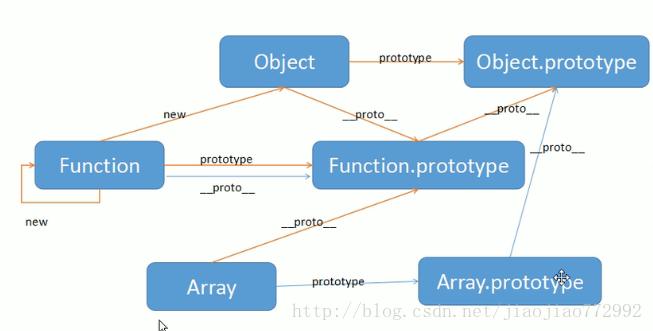

## 问题

- [ ] promise实现中的cbs为什么是个数组
- [ ] bind最终实现中，通过空函数做了中转，为什么可以这么做
- [ ] vue项目中 request.js中为什么不能用this.$store：在跟组件注册了store之后，所有的vue文件可以使用this.$store访问store，但是js文件不可以
- [ ] require('')和import ''的区别
- [ ] 生成路由为什么写到store的action里面


## 代办

- [ ] vue官方文档，不熟悉的语法
- [ ] vue-cli官方文档，尤其是webpack相关怎么写，以及项目中很多文件如何配置等工程化的东西
- [ ] 代码格式Eslint插件
- [ ] vue全局变量有什么
- [ ] store模式和vuex https://vuex.vuejs.org
- [ ] 自定义指令
- [ ] vue 装饰器
- [ ] 子组件向父组件传值


## 项目

文档：https://juejin.cn/post/6844903476661583880#heading-9

源码：https://gitee.com/panjiachen/vue-element-admin?_from=gitee_search

#### 角色权限

登录获取token，根据token获取用户权限，根据权限生成该用户可访问的router

router.beforeEach：

1. 在这里对当前用户可访问的路由进行计算

	2. 进行页面级的权限判断

对axios进行封装 -> request：请求级的权限判断

## HTML

#### scroll-view

小程序中scroll-view需要设置高度

下面的代码虽然没有直接设置高度，但是container的style决定了scorll-view的高度

```html
<view id="container" style="height:100%; display:flex; flex-flow:column nowrap">
    <view>搜索</view>
    <scroll-view></scroll-view>
</view>
```

#### defer&async

对于script标签，没有修饰时，脚本的加载和执行会阻塞html解析。defer和async修饰在加载脚本过程不阻塞html解析，acync脚本执行阶段阻塞html解析，defer不阻塞。


## CSS

#### 父子元素高度

子元素高度大于父元素时，超出的部分还是可以正常显示，是因为父元素overflow默认是visible

父元素高度固定，子元素自适应：父元素flex，包含两个子元素，其中一个高度固定，另外一个

父元素高度不确定，根据子元素变化

#### BFC

触发bfc的条件，解决父元素底部塌陷：

1. body元素
2. float不为none
3. position为absolute和fixed
4. display为flex inline-block inline-flex table-cell table-caption
5. overflow除visible以外的

#### display

- [x] block：撑满容器左右边距，不与其他元素同行

- [x] inline：只包裹内容，不占用多余空间

- [x] 弹性盒子flex

  ```css
  display:flex 
  /*以下属性作用于盒子中的元素，盒子中的元素也会自动声明为弹性盒子*/
  /* 盒子中元素的间隔:左对齐（默认）、居中对齐、右对齐、两端对齐且项目间隔相等*/
  justify-context:flex-start、center、flex-end 、space-between
  /*轴对齐方式:向上对齐、居中、向下对齐、拉伸对齐（默认）*/
  align-items:flex-start、center、flex-end、stretch 
  /*主轴为row就是横着排、column就是竖着排，默认row nowrap*/
  flex-flow:row nowrap 
  ```

  以上属性只作用于盒子中的子元素，孙子元素不受控制

- [x] 网格布局

  ```css
  display：grid
  grid-template-columns：列宽
  grid-template-row：行宽
  ```

- [ ] display: -webkit-box;

#### 属性区分

display 布局

position: relative absolute fixed 

float: 浮动，脱离文档流

overflow: 滚动轴

z-index: 配合float和position使用

#### animation

时间 方向  延时 最终状态 循环次数

#### transform

变形 scale rotate translate

#### opacity

透明度，0是透明，1不透明

#### 纯css实现tab

radio checked +

#### visibility & display

visibility占用文档流，display不占用


## JS

#### DOM和BOM

JS组成：https://blog.csdn.net/qq877507054/article/details/51395830

DOM：https://blog.csdn.net/qq_42127861/article/details/82145842

JS由三部分组成：ES，DOM，BOM

ES：ECMAScript，描述了JS的语法和基本对象。

DOM：文档对象模型 document object model，js可以通过dom操作html元素。浏览器把html文档解析为dom，dom是树形结构，树根是document

BOM：浏览器对象模型 brower oject model，js可以通过bom操作浏览器

下图中：ABCD属于BOM，E是DOM


#### BOM常用方法和属性??????

```js
//window的方法
window.getComputedStyle("元素"[,"伪类"]).元素名//能获取所有的style，包括没有在style中明确写出的
//Screen
//Location
//Navigator
//history
```

#### DOM常用方法和属性

document是window的子对象

```js
//document的方法
document.getElementById("")
document.creatElement("")


//DOM Elmement常用方法
appendChild(node)
removeChild(node)
getAttribute(attribute)
setAttribute(attribute,value)
removeAttribute(attribute)

//DOM Elmement常用属性
// https://blog.csdn.net/alokka/article/details/81458962
style//或者或修改定义在style=""中的属性
offsetHeight(offsetWidth)//长(宽) + padding + border
clientHeight(clientWidth)//长(宽) + padding
scrollHeight(scrollWidth)//如果没有滚动条，等同于clientHeight(clientWidth)，如果有就是内容的高度(宽度)
offsetTop(offsetLeft)//上方(左侧)距离窗口距离
clientTop(clientLeft)//上方的(左侧)border
scrollTop(scrollLeft)//滚动后上方(左侧)被隐藏的具体
offsetX(offsetY)
clientX(clientY)
scrollX(scrollY)
```

#### es6数据类型

基本类型：boolean,number, string, undefined, null, symbol, bigInt

复杂类型：object，包含function、date、array

number的构造函数Number，string的构造函数String，boolean的构造函数Boolean.....

null是不存在的值，undefined是已声明未赋值

!null !undefined !0 !'' !NaN都是true

#### typeof

除null之外的基本数据类型，object，function

typeof(null)是object

```js
a = Number(1)
typeof a // number
b = new Number(1)
typeof b // object
```

#### Array

##### 遍历

原始for循环，for of，for in可以响应return continue break，可以修改原数组数据

map，forEach不可以响应

##### 常用方法

push pop shift unshift reverse splice sort ；concat join slice map forEach fliter every some reduce。分号前改变原始数组，分号后不改变

map&foreach：都可以对数组进行遍历，不改变数组。map需要有返回值，根据返回值生成新的数组，空数组也会调用回调；foreach没有返回值，空数组不调用回调

#### String

遍历string：for of，for in效果和array是一样的，不可以用map这类函数

空字符串转Number是0

#### Object

object的key会自动转成string

#### this指向

this是在创建上下文时确定的，并且在上下文执行过程中不变

计算：讶羽大佬的 JavaScript深入之从ECMAScript规范解读this.md

直观例子：https://juejin.cn/post/6844903488304971789

有关箭头函数：在直观链接中有讲解，箭头函数会捕获其所在上下文的 `this` 值，作为自己的 `this` 值，所以当箭头函数所在上下文的`this`值变化时，箭头函数的`this`值也会跟着变化

#### bind call apply

改变this指向

要会实现这三个函数

#### 原型和原型链

每个对象都有一个`_proto_`属性，指向其构造函数的prototype

#### 面向对象

构造函数就是类，约定首字母大写，可以通过new的方式创建对象，一些公共的方法和属性可以定义到原型上。

JavaScript有一些内置构造函数如Number、Array等，内置构造函数的`_prop_`都指向`Function.prototype`，他们都是Function的实例。Object也是Function的实例，所以`Object._prop_`指向`Function.prototype`。但是一切对象都是Object的实例，所以`Function.prototype._prop`指向`Object.prototype`



#### Promise理解

##### 基础

Promise对象的参数是一个函数，该函数有两个参数，这两个参数是两个函数resovle和reject，调用resolve()函数，Promise变成resolved状态，抛出错误或者调用reject()，Promise变成rejected状态。

Promise可以通过then方法指定状态改变后的回调函数，then方法有两个参数，分别为resolved和rejected状态回调函数，resolved状态的回调函数参数是resolve的参数，rejected状态回调函数是reject的参数或抛出的错误，一般情况下只给一个回调。通常会通过catch方法指定rejected状态的回调函数，等同于then(null, rejection)，但是catch指定的回调会同时处理then指定的回调中的异常。

then()和catch()会返回新的Promise对象，所以后边可以使用then和catch指定回调函数，then()和catch()返回的值会作为then的参数，抛出的错误会作为catch的参数。catch和then里面的return被后面的catch和then接受，不会逃出promise

##### 复杂情况

1. resolve参数是一个promise对象：promise的状态由参数中的promise决定

   

2. promise参数函数体是一个promise对象(promise2)，promise的状态取决于合适调用他的resolve()

   ```js
   new Promise((resolve, reject) => {
       new Promise(() => {
           resolve(2)
       })
   }).then(value => {
       console.log(value)
   })
   //2
   ```

3. then指定的回调函数是返回promise对象，等待这个promise对象状态发生变化，才会继续执行后续的then和catch(如果有的话)，这个promise对象resolve的参数会传入后续的then

   ```js
   function Promise2(func) {
       this.cbs = [];
       let resolve = (value) => {
           // resolve执行cbs中的函数必须加setTimeout
           // 否则resolve会在then之前执行，此时cbs是空的
           // 因为then还没有将包装好的回调函数放到cbs中
           setTimeout(() => {
               this.cbs.forEach(cb => cb(value))
           })
       }
       func(resolve)
   }
   
   Promise2.prototype.then = function (onResolved) {
       return new Promise2((resolve) => {
           this.cbs.push((value) => {
               const res = onResolved(value)
               if (res instanceof Promise2) {
                   // 由用户决定什么时候执行then的resolve：
                   // 把resovle作为用户定义的Promise.then的回调函数，包装后放到用户定义的promise的cbs中
                   // 当用会定义的promise实例resolve时，执行cbs中的函数
                   // 用户promise的resolve的参数会作为cbs中的函数的参数，也就是then的resolve的参数
                   res.then(resolve) 
               } else {
                   resolve(res)
               }
           })
       })
   }
   
   // 1.执行传给promise的函数
   // 2.如果指定了then，执行then：返回一个新的promise实例，并且将回调函数包装后放入cbs
   // 3.等待传给promise的函数执行resolve(params)
   // 4.执行resolve(params),也就是执行cbs中的包装函数，就会将then返回的Promise实例resolve
   new Promise2(resolve => {
       resolve(2)
   }).then((value) => {
       return new Promise2(resolve => {
           resolve(value)
       })
   }).then(value => {
       console.log(value)
   })
   // 2
   ```

#### Promise.resolve()

参数是常量时相当于，创建一个Promise对象，然后立即resolve(该常量)

```js
Promise.resolve("test")
//相当于
new Promise(resolve => {resolve("test")})
```

#### async&&await理解

async函数返回一个promise对象，后面可以跟then方法。async函数中return返回的值，是then方法指定的回调函数的参数，抛出错误的话Promise会变成reject状态，错误对象被catch方法指定的的回调接收。

await修饰promise对象时，会等待promise对象执行结束，接受promise对象中resolve或者reject的值，再执行async函数中后边的代码

#### 事件循环机制

js单线程，可能会出现一些cpu空等的情况，比如网络请求，setTimeout等。为了解决这种情况，当出现了异步操作，主线程将这些任务交给响应的模块去处理，处理完成后推入任务队列，cpu空闲后从异步队列中取出一个任务推入主线程

#### let const关键字

先声明再使用，只在自己的作用域内有效，作用域外引用报错

const声明的变量不可以改变

#### 解构化赋值

数组：`[]=[]`

对象：`{}={}`变量和属性名不同时，需要用模式

解构化赋值是浅拷贝

#### callee?????

讶羽深入系类13

#### 字符串

`$().append()`动态添加元素

- [ ] 模板编译
- [ ] 标签模板

#### 字符串新增方法

JS内部，字符用UTF-16存储，一个字节8位，oxFFFF需要2个字节

`fromCodePoint()`：从Unicode码点到字符

`codePointAt()`：从字符到Unicode码点

#### 数值扩展

增加了2进制和8进制，可以使用分隔符_

- [ ] 增加了方法：`Number`和`Math`

#### 函数扩展

参数默认两种方式，一种是解构化赋值的默认值，一种是直接给函数参数设置默认值

`Array.prototype.slice.call(arguments)`能将有length属性的对象转换为数组

#### XMLHttpRequest

axios封装了promise和XMLHttpRequest


## 模块化

#### 标准

commonJS：服务端的标准，nodejs的出现使得的js可以作为服务端语言，后端必然需要模块化，commonjs就是服务端的模块化标准。同步加载，运行时加载。

AMD CMD：浏览器端的模块化标准，异步加载，运行时加载。

ES6：编译时加载

#### webpack作用

深入浅出webpack：http://webpack.wuhaolin.cn/

将浏览器无法解析的代码，如模块化，es6，scss，vue单页面等转换成浏览器可以解析的代码。

#### webpack入门

1. npm init创建package.json，保存所需的依赖和版本。可以通过npm install构建所有的依赖。
2. npm i -D webpack安装webpack，生成node_module文件夹和package-lock.json
3. 在webpack.config.js中写入配置，运行webpack，生成dist文件夹，包含所有的bundle。


## vue框架

全家桶：vue/cli, vue-route, vuex

#### 使用

官方提供了三种使用vue的方式

1. 通过`<script>`引入vue.js
2. 通过cdn，1和2两种方式都是对当前html页面进行增强
3. vue脚手架构建一个单页面应用

#### 脚手架

官方文档：https://cli.vuejs.org/zh/guide/

 vue脚手架的作用是用来自动一键生成vue+webpack的项目模版，包括依赖库，免去手动安装各种插件，寻找各种cdn并一个个引入的麻烦。

#### vuex

官方文档：https://vuex.vuejs.org/zh/

#### 全局变量

__dirname：项目根目录的绝对路径

#### webpack的配置!!!!!

官方文档

#### 基础问题

https://segmentfault.com/a/1190000040971075

#### 生命周期

beforeCreated：vue实例还没有完全创建好，data和methods还没有初始化，此时不能操作data

created：vue实例创建好了，data和methods完成了初始化

beforeMounted：模板编译完成，但是还没有挂载，此时获取不到dom

mouted：完成挂载，可以操作dom

beforeUpdated：data数据已经更新，但是虚拟dom未更新

updated：虚拟dom已经更新

beforeDistory：销毁前

distroyed：销毁完成

https://www.cnblogs.com/zhilu/p/13812822.html

#### 如何实现mvvm

https://www.jianshu.com/p/78c6acb02150

https://zhuanlan.zhihu.com/p/107610658

数据劫持+发布订阅模式

使用object.defineProperty定义所有的属性，增加get和set方法，每个属性还有一个dep属性，在get方法中收集Watcher到dep中，在set方法中通过notify()通知dep中的Watcher进行更新。

Watcher中封装了渲染视图的逻辑，在compile中创建

#### diff算法

一层一层的比较

#### vue-loader!!!!!


## 性能优化!!!!!


## 网络

#### 跨域

解释：协议 主机 端口号有一个不同即为跨域

JSONP：构造具有src属性的标签，这种标签可以跨域，只支持get请求，即使后端不支持跨域可以发起get请求

CORS：浏览器自动处理，用户无感知，主要靠后端实现，可以支持各种类型的http请求

#### 浏览器缓存（http缓存）

https://www.jianshu.com/p/54cc04190252

http://www.alloyteam.com/2016/03/discussion-on-web-caching/

1.先判断缓存中是否存在请求数据，不存在则发起请求，并将数据缓存。

2.如果存在缓存根据cache-control和expires（cache-control优先级高）判断是缓存是否过期，如果有效，直接使用缓存。

3.如果过期向浏览器发起请求，（根据last-modify和eTag字段）携带if-modify-since和if-none-match，浏览器根据这两值判断请求内容是否发生变化，没变化则直接使用缓存，变化则重新返回数据并且更新缓存

#### 本地存储WebStorage

在本地存储用户数据，有localStorage和sessionStorage两种。

localStorage生命周期是永久的，sessionStorage关闭浏览器后消失，页面刷新不消除数据，只有在当前页面打开的链接才可以访问

还有cookies

#### HTTP2.0新特性

二进制分帧、首部压缩、多路复用、请求优先级、服务器推送

#### HTTP和HTTPS的差异

https加密传输，加密过程


## 安全(没有很理解)!!!!!!

#### XSS

跨站脚本攻击cross-site scripting：攻击者在web页面中插入一些恶意代码，用户浏览该页面时恶意代码执行，从而攻击用户，可以分为三类。

反射型：浏览器、后台

存储型：浏览器、数据库、后台

dom-based型：浏览器

防御措施：html编码，将一些敏感字符进行编码

#### CSRF

跨站请求伪造cross-site request forgery：用户登录站点A之后，攻击者诱导用户访问B站点，B站点利用已有的cookie发起一个请求。

防御：referer samesite token


## nodejs

nodejs是javascript的运行环境，就像jvm是java的环境一样

javaScript原本只能依赖于浏览器执行，nodejs的底层是浏览器引擎，又加入了io线程池和网络io，使得javascript可以脱离浏览器，从而使得javaScript可以开发后端。

