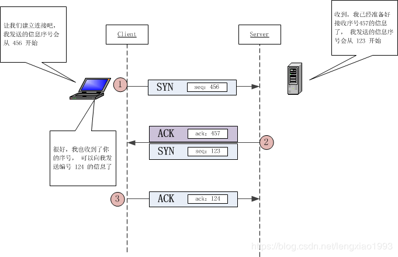
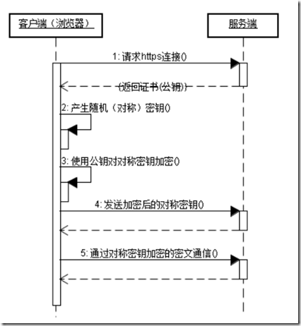
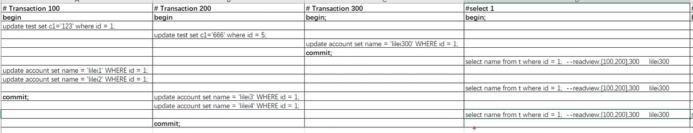
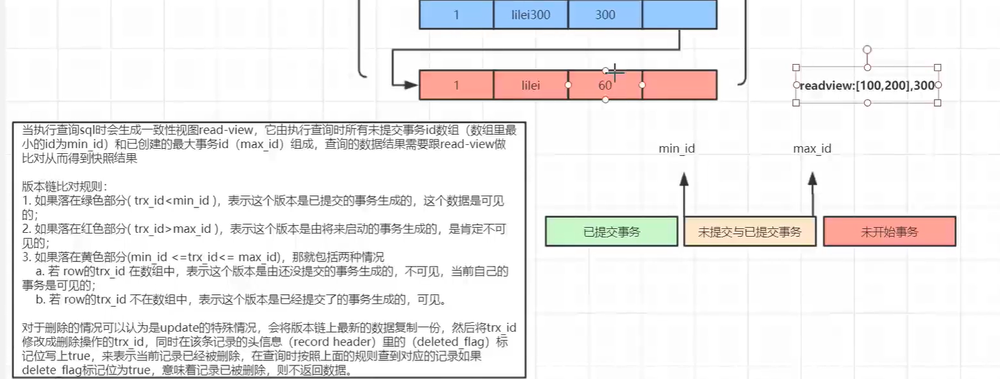

## 计算机网络

#### 浏览器输入一个URL到展示过程

1. dns解析：查询缓存，缓存中不存在，查询dns本地服务器，本地不存在，查询dns根域名，顶级域名，权限域名服务器
2. tcp三次握手建立连接
3. 发送http请求报文，接收响应报文，渲染界面

##### DNS


#### 三次握手，四次挥手 
<<<<<<< HEAD

#### TCP
=======
>>>>>>> a359302b6841741a8e7bd3c288fa0f05d1826162

#### TCP

可靠：三次握手，四次挥手，可靠传输，流量控制，拥塞避免 

流量控制：通过滑动窗口实现

拥塞避免：慢启动，拥塞避免，快重传，快恢复



#### UDP和TCP的区别

udp尽最大努力交付，tcp可靠交付

#### post和get的区别

他们本质上是一样的，都是tcp请求，为了方便处理，http和浏览器制定了一些规范

get用url携带参数，有长度限制，post用请求体携带参数

get常用来请求资源，post常用来传输数据

get是幂等的，post不是

get只发一次请求，post先发送请求头，收到100响应之后再发送请求体

#### http状态码

1xx：服务器收到请求，可以继续

2xx：请求成功

3xx：重定向，302临时重定向

4xx：客户端错误

5xx：服务器错误

#### HTTP2.0新特性

二进制分帧、首部压缩、多路复用、请求优先级、服务器推送

#### Websocket

没看

#### https证书和加密

传输过程中的加密是用对称加密算法，也就是加密密钥和解密密钥相同，而对称加密算法密钥的获取，是用非对称加密得到的，也就是SSL证书。

SSL证书里面包含了网站的域名，证书有效期，证书的颁发机构以及用于加密传输密码的公钥等信息，浏览器接受了这个证书后，会生成对称加密的密钥，用这个证书中的公钥进行加密，站点收到之后会用自己的私钥解密，得到对称加密的密钥，之后的传输都会使用这个对称密钥进行。



有关CA证书:

a.服务方 S 向第三方机构CA提交公钥、组织信息、个人信息(域名)等信息并申请认证；

b.CA 通过线上、线下等多种手段验证申请者提供信息的真实性，如组织是否存在、企业是否合法，是否拥有域名的所有权等；

c.如信息审核通过，CA 会向申请者签发认证文件-证书。

证书包含以下信息：申请者公钥、申请者的组织信息和个人信息、签发机构 CA 的信息、有效时间、证书序列号等信息的明文，同时包含一个签名；

签名的产生算法：首先，使用散列函数计算公开的明文信息的信息摘要，然后，采用 CA 的私钥对信息摘要进行加密，密文即签名；

d.客户端 C 向服务器 S 发出请求时，S 返回证书文件；

e.客户端 C 读取证书中的相关的明文信息，采用相同的散列函数计算得到信息摘要，然后，利用对应 CA 的公钥解密签名数据，对比证书的信息摘要，如果一致，则可以确认证书的合法性，即公钥合法；

f.客户端然后验证证书相关的域名信息、有效时间等信息；

g.客户端会内置信任 CA 的证书信息(包含公钥)，如果CA不被信任，则找不到对应 CA 的证书，证书也会被判定非法。

在这个过程注意几点：

1.申请证书不需要提供私钥，确保私钥永远只能服务器掌握；

2.证书的合法性仍然依赖于非对称加密算法，证书主要是增加了服务器信息以及签名；

3.内置 CA 对应的证书称为根证书，颁发者和使用者相同，自己为自己签名，即自签名证书；

4.证书=公钥+申请者与颁发者信息+签名；

#### 简单请求、复杂请求

 CORS要把请求分成两类：简单请求和预检请求，复杂请求会先发送预检请求，简单请求不会

简单请求：get post head请求，请求头只有accept accept-language content-language content-type，content-type只能是 text/plain、multipart/form-data 或 application/x-www-form-urlencoded 

#### cookie、session、token、jwt

jwt没看

#### 跨域

解释：协议 主机 端口号有一个不同即为跨域

JSONP：构造具有src属性的标签，这种标签可以跨域，只支持get请求，即使后端不支持跨域可以发起get请求

CORS：浏览器自动处理，用户无感知，主要靠后端实现，可以支持各种类型的http请求

#### 缓存机制!!!!!

cdn


#### 缓存机制!!!!!

cdn


## 数据结构 算法

#### 栈、队列

#### 链表、顺序表

#### Hash表

哈希表冲突处理办法：

1. 拉链法
2. 开放定址法
   1. 线性探测
   2. 二次探测
   3. 伪随机探测
3. 再散列法

#### 二叉树

完全二叉树、满二叉树

遍历方式：前中后序遍历，递归和非递归

判段是否为完全二叉树：层次遍历，注意最终条件

#### 图、最小生成树

#### 查找

二分查找，循环需要注意终止条件，只剩一个值也要对这个区间进行查找，所以while中的条件是begin<=end

```java
while(begin<=end)
```

#### B树、B+树、红黑树

没看


## 算法

#### 排序

交换排序：冒泡、快排

插入排序：简单插入、希尔排序

选择排序：简单选择、堆排序(没看)

归并排序：两路归并(递归，终止条件是begin>=end)、多路归并(没看)

以上都是基于比较的排序，还有三个不基于比较的排序：计数排序、桶排序

#### 递归

1. 明确这个函数的功能
2. 递归结束条件
3. 寻找等价关系

#### 动态规划

1. 明确数组中元素的含义
2. 找初始条件
3. 找状态转移方程

#### 动态规划和递归

1. 动态规划是从规模小的到规模大的，递归是从规模大的到规模小的。
2. 如果从规模小的状态很容易联系到规模大的状态，可以用动态规划，否则只能递归，例如dfs只能递归。

#### while语句中嵌套多个条件语句

如果是if elseif，一般不会出错

如果多个if，需要注意第一个if执行结束后，当前的状态有可能不满足while中的条件，但是依然会执行第二个if。

多个if，一定要包含了所有的情况，不然会导致死循环，归并排序！！！！

所以快排两个while循环时，内部的while循环中的条件包含了外部的while循环条件。

#### dfs+回溯

leetcode：113，104，543

```java
//原始dfs：遍历以node为根节点的树
public void dfs(TreeNode node){
    if(null == node) return;
    ///在这里做对结点的操作
    if(null != node.left) dfs(node.left);
    if(null != node.right) dfs(node.right);
}
```

```java
//dfs+回溯：遍历以node为根节点的树，每个节点都会执行dfs，所以action处的操作每个节点都会被操作
public void dfs(TreeNode node,Object object){
    if(null == node) return;
    ///action：在这里做对结点的操作
    if(null != node.left) dfs(node.left);
    if(null != node.right) dfs(node.right);
    //在这里回溯
}
```

#### 模式匹配

没看


## 数据库

##### 1. inner join和left join

##### 2. limit

##### 3. 事务

要么都成功，要么都失败。

ACID四大特性：原子性 隔离性 一致性 永久性

隔离级别：未提交读，已提交读，可重复读，串行化

##### 4. 连接池

提前准备好一组connection，放在连接池中，用时取出，不用每次操作都去连接数据库。

数据源和连接池：数据源可以帮你连接数据库，并且创建连接对象connection，数据源自带池化技术

##### 5. MVCC

实现可重复读：从事务开始得到一个read view，一直到事务结束，每条语句都用这个readview

实现提交读：从事务开始得到一个read view，一直到事务结束，每条语句都重新生成一个readview



Transaction100 和200已经改变了id=1数据的name，但是select1三次读到的数据都是一样的




##### 6. 索引失效

1. where中有对索引列使用函数或者数学运算
2. 组合索引没有使用前列，后列也无法使用
3. or中有非索引列
4. like用%开始
5. 存在隐形类型转换，比如索引时varchar，那么不加“”就不会使用索引

##### 7. 分库分表

1. 垂直
   1. 垂直分表
   2. 垂直分库
2. 水平
   1. 库内分表
   2. 分库分表

## 操作系统

##### 1. 银行家算法

避免死锁

##### 2. 设计LRU算法

用map保存当前存在在内存中的页，用链表维护页的访问顺序

从内存读取数据：判断map中是否有目标页，有则返回结果，并把该页放到链表头部；没有就需要从磁盘中写入内存

将数据读入内存：先判断map是否满了，没有就直接从读入内存，并将该页写到链表头；满了就删除链表尾，再读入内存，写道表头

##### 3. 上下文切换

进程/线程切换 保存寄存器和pc

##### 4. 进程的特性

动态性，并行性，异步性，并发性，独立性

##### 5. 覆盖和对换

覆盖：把一个程序分为独立的程序段，不需要同时执行的放在一组（覆盖段），共享同一个存储空间

对换：把当前暂时不用的进程或数据从内存转移到磁盘，给其他程序让出空间

区别：覆盖一般发生在同一个程序中，处理大程序无法全部装入内存的问题，对换发生在多个程序之间


## 计算机网络(了解)

##### 网段 子网 网络号

ip&子网掩码 == 网段/子网/网络号

##### 同一网段和不同网段通信

判断是否为同一网段：源ip&子网掩码==目的ip&子网掩码？ 同一网段：不同网段

同一网段：ARP请求目的ip的mac，然后封装传输

不同网段：ARP请求网关的mac，先传输到网关，一般是路由器，路由器进行转发，到达目的ip所在子网，再ARP请求目的ip的mac，封装帧，再传输。

##### 网桥 网关 路由器

网桥：工作在二层

> 网桥也叫桥接器，是连接两个局域网的一种存储/转发设备，它能将一个大的LAN分割为多个网段，或将两个以上的LAN互联为一个逻辑LAN，使LAN上的所有用户都可访问服务器。扩展局域网最常见的方法是使用网桥。最简单的网桥有两个端口，复杂些的网桥可以有更多的端口。网桥的每个端口与一个网段相连。
>
> **网桥优点**
> 1、过滤通信量。网桥可以使用局域网的一个网段上各工作站之间的信息量局限在本网段的范围内，而不会经过网桥溜到其他网段去。
> 2、扩大了物理范围，也增加了整个局域网上的工作站的最大数目。
> 3、可使用不同的物理层，可互连不同的局域网。
> 4、提高了可靠性。如果把较大的局域网分割成若干较小的局域网，并且每个小的局域网内部的信息量明显地高于网间的信息量，那么整个互连网络的性能就变得更好。

路由器：工作在三层，连接的网络是不同的局域网

网关：连接不同网络的设备都可以叫做网关，默认网关就是是一个ip，可以在路由器，服务器等

##### ping原理

ping使用的是ICMP协议，这是一个网络层协议

##### 网关

连接两个不同网络的，默认网关其实是一个ip地址，可以存在路由器，三次交换机上

##### 为什么有了mac地址还需要ip地址

 UDP/TCP包：头部是目的端口和源端口   

IP数据包：头部是目的IP和源IP

1. 一台设备对应一个mac地址，不同的局域网有不同的协议并且地址分配没有统一规律。如果没有ip只有mac地址，路由器或者交换机需要存储到达每个mac地址的下一跳地址，这显然是不现实的。
2. ip地址的分配方式是全球统一的，并且有子网的划分。路由器不需要记住每个到达每个ip地址的下一跳，只需要记住子网的下一跳地址即可，到达子网后内部再寻址。
3. mac地址是局域网内部通信使用的，但是不同的局域网有不同的通信协议。为了让局域网之间进行通信，在上边加了一层，也就是网路层，网络层采用IP地址进行通信，IP地址统一分配。

##### 局域网内部数据传输


##### 两台主机通信过程

整个过程中目的IP是不变的，mac地址一直在变

##### 传输层的作用

1. 网络层只提供了主机到主机的传输，但是一台主机上可以有多个程序使用网络。需要传输测通过端口把数据提供给对应的程序，也就是端到端的传输
2. 网络层是一个不可靠的，会出丢包、重复各种问题，这时候就需要传输层提供可靠服务

##### 内部ip地址

10.0.0.0~10.255.255.255

172.16.0.0.~172.31.255.255

192.168.0.0~192.168.255.255


## 基础基础

#### 字符集和字符集编码

字符集：字符和二进制的对应关系，每个字符都有唯一编码，例如Unicode

字符集编码：编码的存储方式，用几个字节存储，例如utf-8，utf-16，utf-32

https://blog.csdn.net/guxiaonuan/article/details/78678043